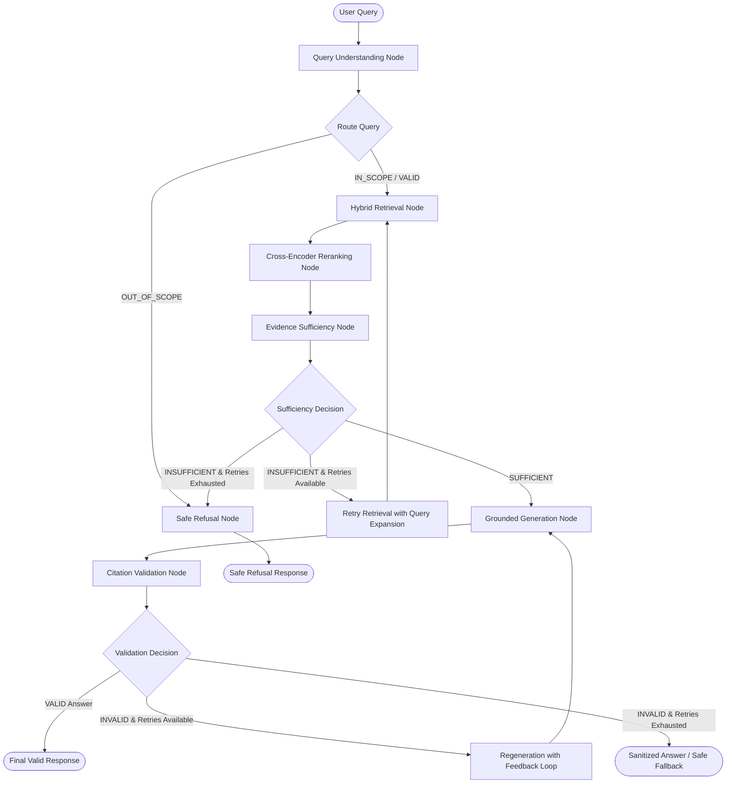

# LangGraph Orchestration Architecture — IP-SAKTI Sahayak

This document specifies the exact production architecture, state transitions, conditional edges, decision nodes, and recovery loops implemented in the **LangGraph Orchestration Layer** for **IP-SAKTI Sahayak (Milestone 5)**.

---

## 1. System Architecture Overview

The IP-SAKTI Sahayak LangGraph engine coordinates between the preprocessing (M1), hybrid retrieval (M2), cross-encoder reranking (M3), and grounded generation / citation validation (M4) systems.

LangGraph operates strictly as an **Orchestration & Decision Layer**:
- It does **not** reimplement lower-level dense embedding, sparse indexing, cross-encoders, or LLM clients.
- It **decides**:
  1. What path a query takes based on multilingual classification and intent.
  2. When retrieval requires controlled broader expansion.
  3. Whether the reranked evidence is sufficient and authoritative.
  4. Whether draft generation meets strict factual containment.
  5. When to trigger targeted claim-level regeneration vs. when to safely terminate.

---

## 2. Strongly Typed Graph State (`GraphState`)

The state is represented as a strongly typed, serializable `TypedDict` in `src/graph/state.py`:

| State Field | Type | Description |
| :--- | :--- | :--- |
| `query` | `str` | Current search query string (may be expanded during retries) |
| `original_query` | `str` | Unmodified user query |
| `expanded_query` | `Optional[str]` | Domain/legal terminology expanded query |
| `language` | `str` | Detected input language (`English`, `Hindi`, `Hinglish / Code-Mixed`) |
| `query_type` | `str` | Classified type (`FACTUAL`, `EXACT_LOOKUP`, `AYURVEDA_IP`, `MULTILINGUAL`, `CROSS_DOMAIN`, `OUT_OF_SCOPE`, `INSUFFICIENT_EVIDENCE`) |
| `jurisdiction` | `str` | Detected legal jurisdiction (`India`, `WIPO/PCT`, `EPO`, `International`) |
| `domains` | `List[str]` | Recognized domain tags (`PATENT`, `AYURVEDA`, `TRADITIONAL_KNOWLEDGE`, `BIODIVERSITY`, `INTERNATIONAL_IP`) |
| `exact_identifiers` | `List[str]` | Exact statutory provisions, rules, or articles detected (`Section 3(p)`, `PCT Rule 43bis`) |
| `retrieval_candidates` | `List[Dict]` | Raw fused candidates from BGE-M3 + BM25 + RRF |
| `reranked_candidates` | `List[Dict]` | Top candidates scored by `BAAI/bge-reranker-v2-m3` |
| `selected_evidence` | `List[Dict]` | Top-k diversity-aware evidence chunks |
| `formatted_evidence` | `str` | Strict `[E#]` evidence text formatted with provenance |
| `evidence_map` | `Dict[str, Dict]` | Map of `E#` identifiers to chunk metadata |
| `detected_conflicts` | `List[Dict]` | Source authority or inter-statutory divergence flags |
| `retrieval_attempt` | `int` | Counter tracking retrieval attempts (Max: `MAX_RETRIEVAL_RETRIES=1`) |
| `evidence_sufficient` | `bool` | Decision flag from Evidence Sufficiency Node |
| `evidence_sufficiency_reason` | `str` | Reason for sufficiency or deficiency |
| `draft_answer` | `str` | Raw LLM output with `[E#]` grounding tags |
| `claims` | `List[Dict]` | Extracted claim-level assertions |
| `citations` | `List[Dict]` | Structured citation objects mapped to legal metadata |
| `generation_attempt` | `int` | Counter tracking generation attempts (Max: `MAX_GENERATION_RETRIES=2`) |
| `citation_validation` | `Dict[str, Any]` | Detailed validation payload from `ClaimCitationValidator` |
| `validation_status` | `str` | `VALID`, `INVALID`, `RETRY_GENERATION`, `REFUSAL` |
| `validation_feedback` | `Optional[str]` | Targeted corrective prompt feedback for regeneration |
| `final_answer` | `str` | Final formatted output with numerical citations `[1]` and Sources block |
| `is_refusal` | `bool` | Flag indicating safe refusal status |
| `is_valid` | `bool` | Flag indicating passing citation validation status |
| `node_latencies_ms` | `Dict[str, float]` | Millisecond latency recorded per graph node |
| `total_latency_ms` | `float` | End-to-end graph execution latency |
| `execution_trace` | `List[Dict]` | Complete audit trail of node executions and decisions |

---

## 3. Node Specifications & Responsibilities

### 3.1. Query Understanding Node (`QueryUnderstandingNode`)
- **Location**: `src/graph/nodes/query_understanding_node.py`
- **Core Logic**:
  - Detects language via Devanagari script analysis and Hindi transliteration regexes.
  - Identifies out-of-scope queries (e.g. sports, cooking, general physics, unrelated finance) deterministically.
  - Extracts exact statutory provisions (e.g., `Section 3(p)`, `Section 3(d)`, `Section 6`, `PCT Rule 43bis`, `Article 21`).
  - Identifies domain intersection (cross-domain detection when query mentions Patent + Ayurveda + Biological Resources).
  - Performs bilingual entity expansion for Hindi/Hinglish (e.g., `पारंपरिक ज्ञान` $\rightarrow$ `Traditional Knowledge TKDL`, `जैव विविधता` $\rightarrow$ `Biological Diversity NBA`).

### 3.2. Hybrid Retrieval Node (`RetrievalNode`)
- **Location**: `src/graph/nodes/retrieval_node.py`
- **Underlying Engine**: `HybridSearchEngine` (BGE-M3 Dense + Qdrant + BM25 Sparse + Reciprocal Rank Fusion).
- **Retry Mechanism**:
  - If `retrieval_attempt > 1`, expands search candidate pool from `top_k=25` to `top_k=40` and relaxes strict filters to retrieve wider context.

### 3.3. Reranking Node (`RerankingNode`)
- **Location**: `src/graph/nodes/reranking_node.py`
- **Underlying Engine**: `CrossEncoderReranker` (`BAAI/bge-reranker-v2-m3`) + `DiversityAwareSelector`.
- **Core Logic**:
  - Computes cross-encoder relevance scores for all candidate chunks.
  - Enforces domain diversity selection for cross-domain queries, ensuring chunks from all identified domains (e.g., Patent Act, Biological Diversity Act, AYUSH guidelines) are preserved in the top-5 evidence set.

### 3.4. Evidence Sufficiency Node (`EvidenceSufficiencyNode`)
- **Location**: `src/graph/nodes/evidence_sufficiency_node.py`
- **Decision Engine**:
  - Evaluates top-1 score threshold (`MIN_EVIDENCE_SCORE = 0.15`).
  - Verifies presence of exact statutory identifiers in retrieved evidence text when exact sections were requested.
  - Checks domain coverage ratio (`MIN_DOMAIN_COVERAGE = 0.50`).
  - Sets `evidence_sufficient = True/False`.

### 3.5. Grounded Generation Node (`GenerationNode`)
- **Location**: `src/graph/nodes/generation_node.py`
- **Underlying Engine**: `AnswerGenerator` (Gemini API with strict grounding policy).
- **Feedback-Aware Prompting**:
  - When `generation_attempt > 1`, injects `validation_feedback` into the prompt (e.g., *"Correction Required: Claim 2 was unsupported. Remove unsupported assertions and strictly cite evidence [E1]-[E5]."*).

### 3.6. Citation Validation Node (`CitationValidationNode`)
- **Location**: `src/graph/nodes/citation_validation_node.py`
- **Underlying Engine**: `CitationEngine` + `ClaimCitationValidator`.
- **Core Logic**:
  - Converts bracketed citations `[E#]` into numbered references `[1]`, `[2]`.
  - Extracts distinct claim sentences and verifies claim-to-evidence overlap.
  - Flags unsupported claims, hallucinated citations, or statutory misattributions.
  - If invalid and attempts < `MAX_GENERATION_RETRIES (2)`, routes back for targeted regeneration.

### 3.7. Safe Refusal Node (`SafeRefusalNode`)
- **Location**: `src/graph/nodes/safe_refusal_node.py`
- **Output**: Returns the standardized refusal message without hallucination:
  > *"I could not find sufficient authoritative evidence in the available knowledge base to answer this conclusively."*
  > With specialized Scope Notices for out-of-scope inquiries.

---

## 4. Conditional Edge Routers

1. **`route_query(state)`**:
   - `OUT_OF_SCOPE` $\rightarrow$ `safe_refusal`
   - Otherwise $\rightarrow$ `retrieval`

2. **`route_sufficiency(state)`**:
   - `evidence_sufficient == True` $\rightarrow$ `generation`
   - `evidence_sufficient == False` AND `retrieval_attempt < MAX_RETRIEVAL_RETRIES (1)` $\rightarrow$ `retrieval` (broader retry)
   - `evidence_sufficient == False` AND retries exhausted $\rightarrow$ `safe_refusal`

3. **`route_validation(state)`**:
   - `validation_status == "VALID"` $\rightarrow$ `END`
   - `validation_status == "RETRY_GENERATION"` $\rightarrow$ `generation` (regeneration with feedback)
   - `validation_status == "INVALID"` (retries exhausted) $\rightarrow$ `END` (with sanitized fallback)

---

## 5. Architectural Invariant Guarantees

1. **Deterministic Termination**: The graph has strict retry limits (`MAX_RETRIEVAL_RETRIES = 1`, `MAX_GENERATION_RETRIES = 2`). Infinite loops are mathematically impossible.
2. **Authority Hierarchy Preservation**: Primary statutes (Tier 1) are ranked above guidelines (Tier 2) and studies (Tier 3).
3. **Exact Provision Integrity**: Exact statutory lookups (`Section 3(p)`, `PCT Rule 43bis`) require exact lexical support in the retrieved chunks before proceeding to generation.
4. **Multilingual Answer Matching**: Responses to Hindi/Hinglish queries maintain linguistic alignment while strictly preserving authoritative legal terminology.
